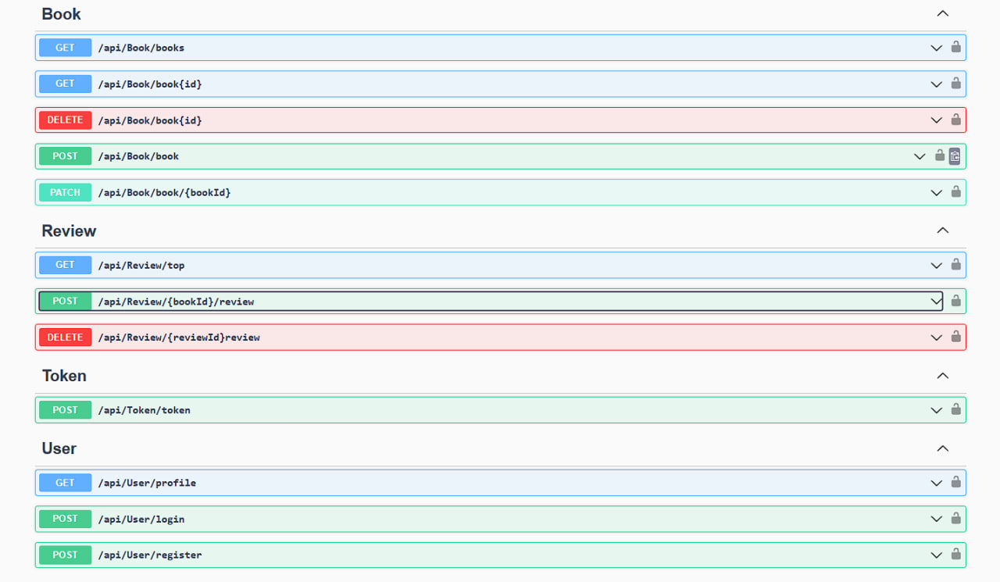

# Book

## 📌 О проекте
**Book Application** - pet проект, для управления книгами и отзывами к ним в некой электронной библиотеке. Приложение написано на C#, ASP.NET Core Web Api, всё взаимодействие происходит в Swagger. Приложение имеет основные функции CRUD, добавить, удалить, изменить, обновить; систему входа(авторизация и регистрация); jwt token (access и refresh token).

## ✨ Функциональные возможности

### 🔐 Система входа
Для того чтобы начать пользоваться функциями, нужно авторизоваться в системе. Для этого есть авторизация и регистрация. Регистрация происходит по username и password (у password есть валидация, не менее 8 символов). Все данные сохраняются в БД. При авторизации мы вводим также username & password, если всё успешно то нам выдаст ответ 200 OK, а также access & refresh token, access token мы вставляем в swagger в кнопку авторизации.которая находится в самом начале и нас авторизирует в системе. После этого нам доступны все функции, которые даёт наша роль. В приложении две роли - user и admin. User - обычный пользователь который может просматривать книги и добавлять к ним отзывы, а также удалять свои отзывы, админ может всё. Все пароли в БД хранятся в ЗАШИФРОВАННОМ виде.

### 🔐 Основные операции над книгами и отзывами
Методы Book. Существует различные функции управления книгами:
- **GET /api/Book/books** - выведет нам все книги по заданным параметрам (n-страница, n-размер страницы, сортировка по названию книги или дате выпуска её, по возрастанию или убыванию), а конкретно к ним название, дата выпуска, средний рейтинг, описание.
- **GET /api/Book/book{id}** - выведет детальную информацию определенной книги по её ID. Конкретно выведет название, автора, описание, средний рейтинг, а так же все отзывы о ней.
- **DELETE /api/Book/book{id}** - функция удаления книги из библиотеки к ней имеет доступ только админ, удаляет книгу с её отзывами.
- **POST /api/Book/book** - функция добавления книги, имеет доступ только админ. Добавляется по параметрам название, автор, дата выпуска, описание, также есть поля createdAt & updatedAt это всё автоматически генерируется при взаимодействии с функцией.
- **PATCH /api/Book/book/{bookId}** - функция частичного изменения информации о книги.

Методы Review:
- **GET /api/Review/top** - вывод топ n-книг по среднему рейтингу, выведет список книг по заданному n.
- **POST /api/Review/review{bookId}** - функция добавления отзыва о книги, задаётся id книги которой присвоен будет отзыв, рейтинг от 1 до 5, а так же комментарий.
- **DELETE /api/Review/review{bookId}** - удаления отзыва, имеет доступ и пользователь и админ. Но пользователь может удалять только свой отзыв, а админ любые.

Метод Token.

 **POST /api/Token/token** - это функция для обновления access токена. В функцию подаётся refresh token, затем от него уже генерируется новые два токена, а также записывается в БД refresh token. В приложении также присутствует фоновый сервис, который удаляет устаревшие или отозванные токены, запускается 1 раз через определенное время, первая очистка происходит при запуске приложения.

 Методы User: 
 - **GET /api/User/profile** - выдаст информацию о текущем авторизованном пользователе.
 - **POST /api/User/login** - авторизация пользователя. Система хеширует введеный пароль и сравнивает с паролем из БД, если успешно то даёт доступ к системе.
 - **POST /api/User/register** - регистрация пользователя по username & password.

 

  
   
  Интерфейс Swagger

## Планы на приложение
- В приложение нужна возможность, чтобы пользователь мог предлагать свои книги, предложенная книга будет проходить через модерацию админа и админ уже будет решать добавлять в библиотеку такую книгу или нет.